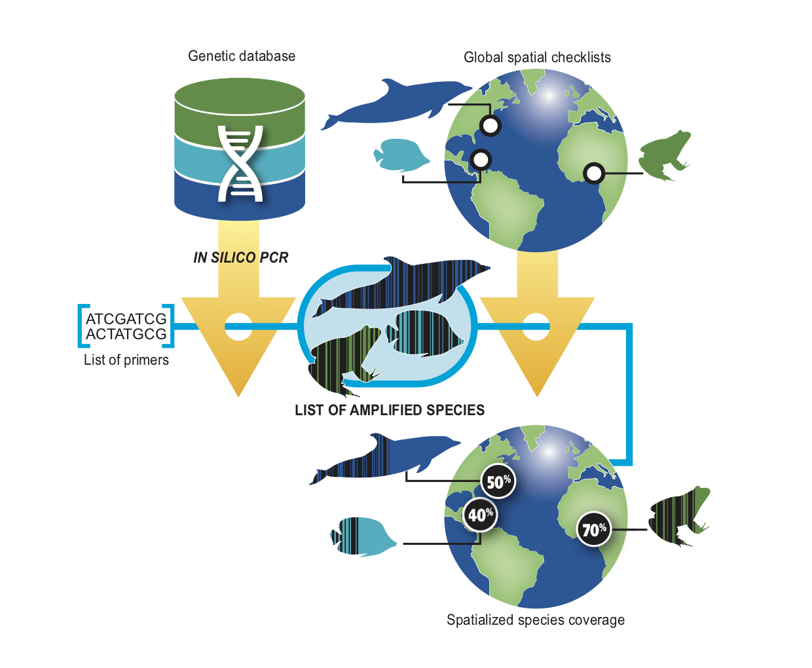

# GAPeDNA

[](https://onlinelibrary.wiley.com/doi/10.1111/ddi.13142?af=R)
[](LICENSE)
[](https://shiny.cefe.cnrs.fr/GAPeDNA/)

**GAPeDNA** is an interactive web application for exploring taxonomic coverage gaps in eDNA metabarcoding reference databases. For a given primer pair and taxonomic group, it maps the proportion of species represented in the reference database across spatial regions worldwide.

🌐 **Live app:** [shiny.cefe.cnrs.fr/GAPeDNA](https://shiny.cefe.cnrs.fr/GAPeDNA/)

> If the link is unavailable, the server may be under maintenance (typically resolved within a few days). Please [open an issue](https://github.com/virginiemarques/GAPeDNA/issues) if the outage persists.

---

## Overview



Reference sequences can now be recovered even in the absence of the primer binding sites by in silico PCR. GAPeDNA accounts for up to 3 mismatches per primer.

The database is updated periodically. Current version: **MIDORI2 GenBank 269 (2025-12-09)**.

---

## Features

- **Interactive choropleth maps** — visualise per-region primer coverage as a percentage of species with a reference sequence
- **Species table** — click any polygon to display the full species list for that region, including IUCN conservation status and sequencing status for the selected marker
- **Sequence extraction** — upload a downloaded species table to retrieve the corresponding reference sequences and per-primer mismatch counts
- **Download** — export species tables and sequence data as CSV

---

## Taxonomic groups & spatial resolutions

| Group | Spatial resolutions | Checklist source |
|---|---|---|
| Marine fish | Ecoregions, Provinces, World | [Barrier et al. 2020](https://www.nature.com/articles/s41559-019-0950-y) |
| Freshwater fish | Drainage basins, World | [Tedesco et al. 2017](https://www.nature.com/articles/sdata2017141) |
| Elasmobranchs (sharks & rays) | Ecoregions, Provinces, Basins, World | [IUCN Red List spatial data](https://www.iucnredlist.org/resources/spatial-data-download) |

---

## How to use the app

### World maps pane

1. **Choose a taxon** — marine fish, freshwater fish, or elasmobranchs
2. **Choose a spatial resolution** — available options update automatically based on the taxon
3. **Choose a mitochondrial marker position** — 12S, 16S, COI, CytB, or 18S
4. **Choose a primer pair** — the interactive map renders immediately

Hover over any polygon to display the percentage of species sequenced. Click a polygon to load the full species list in the table below, with IUCN status and sequencing status per species. The table supports filtering and sorting. Use the **Download** button to export it as CSV.

### Sequence extraction pane

Upload a CSV file exported from the World maps pane. The app will join each species to its reference sequence for the corresponding marker and display per-primer mismatch counts. The full table (including complete sequences) can be downloaded.

---

## Demonstration


---

## Run locally

You need R (≥ 4.1) with the following packages installed:
`shiny`, `leaflet`, `sf`, `dplyr`, `DT`, `htmltools`, `shinythemes`, `shinycssloaders`

**Option 1 — directly from GitHub:**

```r
library(shiny)
runGitHub("GAPeDNA", "virginiemarques")
```

**Option 2 — clone and run:**

```bash
git clone https://github.com/virginiemarques/GAPeDNA
cd GAPeDNA
```

```r
library(shiny)
runApp()
```

> The `data/data_for_GAPeDNA.Rdata` file (~100 MB) is not included in the repository. It is generated by the companion pipeline in [`Generate_data_GAPeDNA`](../Generate_data_GAPeDNA/) or available on request.

---

## Contributing

Contributions to expand GAPeDNA's taxonomic scope are welcome. To propose a new group, please [open an issue](https://github.com/virginiemarques/GAPeDNA/issues) labelled `enhancement` and provide:

- One or more primer pairs targeting the group
- A global, spatialised species checklist at an appropriate resolution

---

## Citation

If you use GAPeDNA in your work, please cite:

> Marques V. et al. (2021). GAPeDNA: Assessing and mapping global species gaps in genetic databases for eDNA metabarcoding. *Diversity and Distributions*, 27, 1142–1155. https://doi.org/10.1111/ddi.13142

---

## Credits

- **Development & maintenance:** Virginie Marques
- **Illustration:** P. Lopez (UMR MARBEC)
- **Server deployment:** A. Granier (CEFE)
- **In silico PCR:** [CRABS](https://github.com/gjeunen/reference_database_creator)

---

## License

MIT © Virginie Marques — see [LICENSE](LICENSE) for details.
